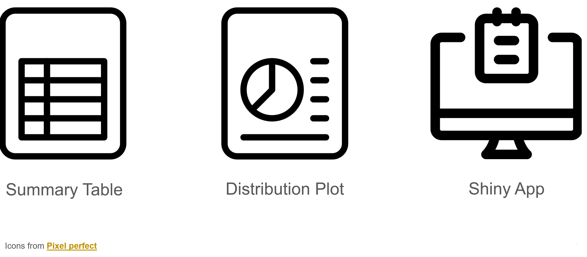
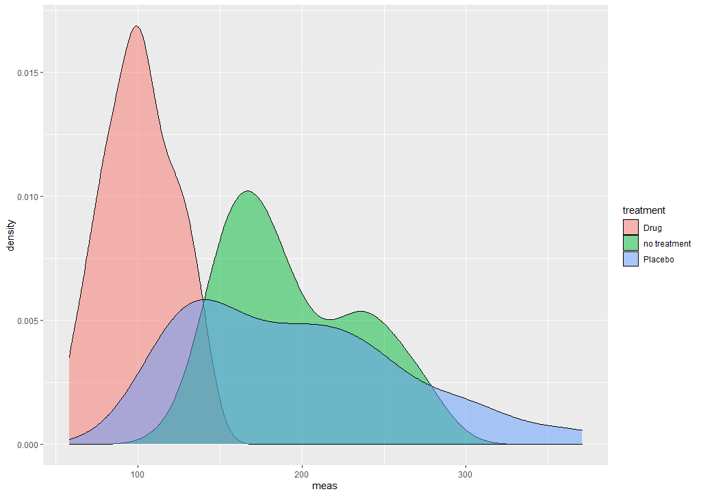
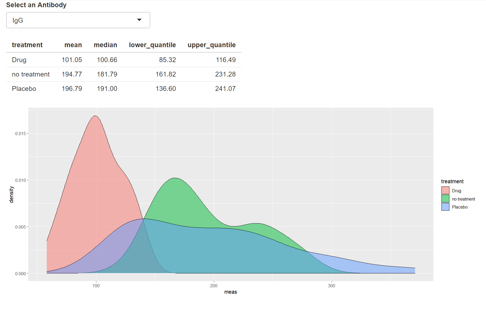

# Why continuous integration will save jour team and your packages

This is a talk given as a *Lightning talk* at the [userR European Hub 2020](https://user2020.r-project.org/). The README will guide you through the talk with code-examples and some tips for best-practices.

## Introduction

Drug development is important for people's life. Especially in the times of COVID-19 you want to make sure drugs get developed fast and secure. Imagine you found a new drug that can change Antibody levels against COVID-19, or any other disease. A statistical evaluation will decide if the drug goes to market or not. Therefore the following questions need to be answered:

* Does it increase/decrease people's Antibody level or not?
* Does the drug perform better or worse compared to a placebo?

Two experiments were carried out to answer this question. One checking IgG Antibody levels, and one checking out IgA antibody levels. In a **real use-case** many more experiments would be carried out. But let's leave it simple.

The following story will show you what can happen if your co-workers mess with your 
## Statistical evaluations

To check the drug the clinician ask as for the following statistical evaluations:

1. A summary table showing the Antibody levels with/without treatment including distribution quantiles. It is
  important for the outcome, that distributions do not overlap for a certain percentage of patients.
2. A distribution plot of the Antibody levels with/without treatment
3. A shiny-app where the user can switch between the antibodies and see both 



## The standard way of working

So now if a Statistician would see these requirements, he or she would start writing a script, let's call it `summary_script.R` and an app called `app.R`. Maybe some libraries like `dplyr` or `ggplot2` would be used. 

In this case imagine the experimental data would be provided as a list that has the following structure:

```
experimental_data
|- IgG (data.frame)
  |- meas (numeric)
  |- treatment (factor)
|- IgA
  |- meas (numeric)
  |- treatment (factor)
```


### Analysis script

The script would contain something like this:


```r
# ---- * summary table IgG ----
experimental_data$IgG %>%
  dplyr::group_by(treatment) %>%
  dplyr::summarise(
    mean = mean(meas),
    median = median(meas),
    lower_quantile = quantile(meas, 0.1),
    upper_quantile = quantile(meas, 0.9)
  )
  
# ---- * distribution plot IgG ----

ggplot(experimental_data$IgG, aes(x = meas, fill = treatment)) +
  geom_density(alpha = 0.5)
```

the outcome would be the following:

```r
# A tibble: 3 x 5
  treatment     mean median lower_quantile upper_quantile
  <fct>        <dbl>  <dbl>          <dbl>          <dbl>
1 Drug          116.   116.           90.3           146.
2 no treatment  195.   182.          149.            253.
3 Placebo       197.   191.          125.            295.
```



There would be two take aways:

1. The drug lowers the IgG levels by 30%.
2. There is no overlap between the `no_treatment` and `drug` distributions (checked for 80% of the patients).

### Analysis App

The same can immediately go into an app:

```r

ui <- function() {
  fluidPage(
    selectInput("antibody", "Select an Antibody", choices = c("IgG", "IgA"), selected = "IgG", multiple = FALSE),
    tableOutput("summary_table"),
    plotOutput("distribution_plot")
  )
}

server <- function(input, output) {
  output$summary_table <- renderTable({
    experimental_data[[input$antibody]] %>%
      dplyr::group_by(treatment) %>%
      dplyr::summarise(
        mean = mean(meas),
        median = median(meas),
        lower_quantile = quantile(meas, 0.25),
        upper_quantile = quantile(meas, 0.75)
      )
  })
  
  output$distribution_plot <- renderPlot({
    ggplot(experimental_data[[input$antibody]], aes(x = meas, fill = treatment)) +
      geom_density(alpha = 0.5)
  })
}

shinyApp(ui, server)
```



## Here comes the problem!

Now imagine you are gone during your vacation and your co-worker get's your code. Additionally there is a request from the Clinician, to add the *Standard Deviation* to the summary table, as the Clinician is familiar with this indicator.

Your co-worker takes your script and changes the following in the `summary_script.R` and `app.R`.

```r
experimental_data$IgG %>%
  dplyr::group_by(treatment) %>%
  dplyr::summarise(
    mean = mean(meas),
    median = median(meas),
    lower_quantile = quantile(meas, 0.01),
    upper_quantile = quantile(meas, 0.99),
    sd = sd(meas)
  )
```
the outcome would be the following:

```r
# A tibble: 3 x 6
  treatment     mean median lower_quantile upper_quantile    sd
  <fct>        <dbl>  <dbl>          <dbl>          <dbl> <dbl>
1 Drug          116.   116.           76.0           156.  21.4
2 no treatment  195.   182.          137.            278.  41.1
3 Placebo       197.   191.          115.            362.  65.7
```

These numbers get reported in the clinical study report. You come back after your vacation and you notice:

:warning: The distributions of `no treatment` and `drug` now overlap :warning:

*What is critical about this?* The drug might not go to market, because this was an exclusion criterium for
the drug. These distributions shall not overlap.

*Why is that?* Because your co-worker did not only add the `sd`, but also changed the quantile levels from 90% to 99%.

*How long will it take you to find this?* This depends on how you have stored the script, if you can compare values. How did you store the app...

*How can you avoid this?* This is what the following chapter is about!

## Enhancing collaboration on data science projects in R

There are three things that will make it way easier to collaborate:

### Version control in e.g. Github

makes it easy to track changes and even revert them.

### Wrapping your code into an R-package with tests

Allows you to have some basic documentation, double check by `R CMD check` everytime a new user adds code.

### Run checks automatically

Running checks every time a user changes your code, allows you to control:

* act fast!
* the environment the checks run in
* the possibility to add code to your code-base
* give coders feedback without needing to ask their co-workers

---

All three topics are important for R-coding. But as *Version Control* and *R packages* are a standard in developing R. I will only focus on *Run checks automatically*

## Automatic checks

So now imagine, instead of writing a `summary_script.R` and `app.R` file you did the following:

* Wrap everything into an R-package
* Write a function `summary_table`
* Write a function `summary_plot`
* Include a shiny-module called `summaryModule` with the functions `summaryUI` and `summaryServer`
* Store your code inside Github and protect the `master` branch from direct commits

## How to make it fail proof?

### Include a test for the numerics

As a first input, I recommend using [`testthat`](https://testthat.r-lib.org/) to test your R package. To use it
you need to include a file `testthat.R` in the `tests` folder of your package. This file only contains the code

```r
library(testthat)

testthat::test_check("useRMUCDemo")
```

Then you continue and create the directory `tests/testthat` inside which you create the file `test_numerics.R`. This file contains a check for the quantiles for an example data set:

```r
context("numerical testing")

test_that("summary table", {
  data("experimental_data")
  
  result <- expect_silent(summary_table(experimental_data$IgG$meas, experimental_data$IgG$treatment))
  
  expect_equal(
    result$lower_quantile,
    c(90.29758, 149.46806, 125.22527)
  )
  
  result <- expect_silent(summary_table(experimental_data$IgA$meas, experimental_data$IgA$treatment))
  
  expect_equal(
    result$lower_quantile,
    c(23, 20, 15)
  )
})

```

Now if you run `devtools::test()` inside your package, you will get this output:

```r
Loading useRMUCDemo
Testing useRMUCDemo
√ |  OK F W S | Context
√ |   4       | numerical testing

== Results =====================================================================
OK:       4
Failed:   0
Warnings: 0
Skipped:  0
```

These checks will also run if you use `R CMD check`.

### Include an app for shinytest

A guide on how to use shinytest in an R-package can be found here: https://rstudio.github.io/shinytest/articles/package.html.

After you have read the guide, you can setup a test app like this:

```r
source("../shinytest_load_pckg.R")

eval(shinytest_load_pckg("useRMUCDemo"))

data(experimental_data)

ui <- fluidPage(
  summaryUI("counter1", dataset = experimental_data)
)

server <- function(input, output, session) {
  callModule(summaryServer, "counter1", dataset = experimental_data)
}

shinyApp(ui, server)
```

`shinytest_load_pckg` will provide some code to load the package while in `devtools::test()` or `devtools::check()` or `R CMD check`. Because all of those have different behaviour.

Now you can store the app inside `tests/testthat/app_test/app.R` and record a shinytest.

```r
shinytest::recordTest("app_test")
```

Creating a file `tests/testthat/test_app.R` with this content will allow to test the app within `devtools::test()`:

```r
library(shinytest)
context("App with table and plot")
test_that("app works", {
  expect_pass(testApp("app_test", compareImages = FALSE, interactive = FALSE))
})

### Use Jenkins / Travis CI / GoogleCloudBuild for automatic testing

Now you need to include any CI tool to automatically run package checks upon pushing to Github. There are several guides available for this:

* [Travis CI for R — Advanced guide](https://towardsdatascience.com/travis-ci-for-r-advanced-guide-719cb2d9e0e5?gi=906d5a74e98b)
* [ R scripts in the cloud, via Cloud Run, Cloud Build and Cloud Scheduler.](https://code.markedmondson.me/googleCloudRunner/)
* [How to test your internal packages - discussion](https://community.rstudio.com/t/how-do-you-test-your-internal-packages-travis-jenkins-by-hand/13002)

This example project was setup with [GoogleCloudBuild](https://console.cloud.google.com/cloud-build/builds/f2bfda2f-4c67-4c9c-b73d-9bd031220699?project=736775587969)

## See what happens upon a user changing code the wrong way

